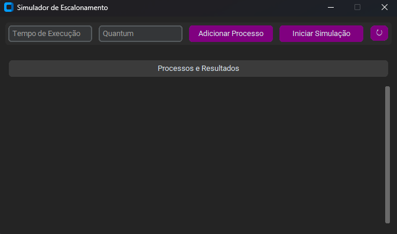
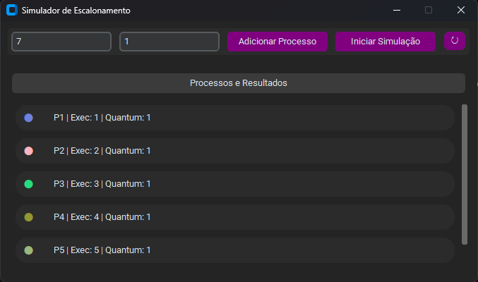
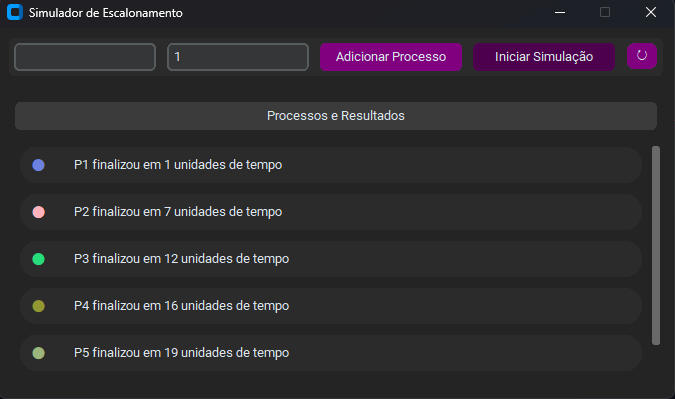

# 📚 Simulador de Algoritmos de Escalonamento — Round Robin

  

---

## ✨ Demonstração

| Tela Inicial                                              | Adicionar Processos                                       | Simular Round Robin                                  
| --------------------------------------------------------- | --------------------------------------------------------- | ---------------------------------------------------------- 
|  |  |  

---

## 🎯 Objetivo

Fornecer uma implementação simples e didática do algoritmo **Round Robin** para uso em um simulador de escalonamento. O código permite:

* Adicionar processos com tempos de execução (unidades arbitrárias).
* Definir um **quantum** (fatias de tempo iguais) — definido apenas na criação do primeiro processo e fixado durante a simulação.
* Executar a simulação e obter os tempos de finalização de cada processo.
* Testar a lógica via uma interface desktop simples (`main.py`) ou chamando a função `round_robin` diretamente.

---

## 🗂 Arquivos principais

* `backend/round_robin.py`

  * Implementa a função `round_robin(processos, quantum)` que recebe uma lista de processos (`[{"pid": "P1", "exec": 5, "quantum": 3, "cor": "#..."}, ...]`) e o `quantum` fixo, e retorna uma lista com o tempo de finalização de cada processo (na ordem recebida).

* `backend/escalonador.py`

  * Classe `Escalonador` que mantém o estado dos processos, gera PID, escolhe cores aleatórias para cada processo e fixa o quantum quando o primeiro processo é adicionado. Fornece métodos:

    * `adicionar_processo(tempo_exec, quantum_input=None)` — adiciona um processo (e define o quantum caso ainda não exista).
    * `executar_round_robin()` — invoca `round_robin` com os processos armazenados.
    * `resetar()` — limpa o estado.

* `backend/main.py`

  * Interface simples com `customtkinter` para adicionar processos, fixar quantum, iniciar a simulação e visualizar resultados. Útil para testes interativos.

---

## ✅ Como funciona o algoritmo Round Robin — explicação intuitiva

Round Robin (RR) é um algoritmo preemptivo concebido para escalonar processos de forma justa e responsiva. Ele funciona assim:

1. Os processos são colocados em uma fila FIFO na ordem de chegada.
2. Existe um parâmetro `quantum` (p.ex. 3 unidades). Cada processo, ao receber CPU, roda por no máximo `quantum` unidades.
3. Se um processo concluir antes do fim da fatia, libera a CPU e registra seu tempo de conclusão.
4. Se não concluir, sua execução restante é reduzida em `quantum` e ele vai para o final da fila.
5. Repete-se até que não haja mais processos.

Vantagens: boa responsividade para sistemas interativos; evita inanição (starvation).
Desvantagens: overhead de troca de contexto se `quantum` for muito pequeno; desempenho ruim para throughput se `quantum` for muito grande (chegando a se comportar como FCFS).

---

## 🔎 Exemplo passo a passo

Processos: P1=5, P2=3, P3=8 — Quantum = 3

* t=0: fila = \[P1, P2, P3]
* P1 recebe CPU por 3 → resta 2 → t=3 → fila = \[P2, P3, P1]
* P2 recebe CPU por 3 → resta 0 → t=6 → P2 finaliza em 6 → fila = \[P3, P1]
* P3 recebe CPU por 3 → resta 5 → t=9 → fila = \[P1, P3]
* P1 recebe CPU por 2 → resta 0 → t=11 → P1 finaliza em 11 → fila = \[P3]
* P3 recebe CPU por 3 → resta 2 → t=14 → fila = \[P3]
* P3 recebe CPU por 2 → resta 0 → t=16 → P3 finaliza em 16

Tempos de finalização: `[11, 6, 16]` (P1, P2, P3)

---

## 📦 Como funciona o algoritmo FIFO? (First In, First Out)

O algoritmo FIFO é uma estratégia de escalonamento não-preemptiva em que os processos são atendidos na ordem em que chegam, semelhante a uma fila de supermercado: quem chega primeiro, é atendido primeiro.

Funcionamento:

* Todos os processos entram em uma fila (FIFO).

* O primeiro processo da fila recebe a CPU e é executado até terminar, sem interrupções.

* Quando o processo termina, o próximo da fila começa a ser executado.

* Repete-se o ciclo até que não existam mais processos na fila.

Vantagens: simples de implementar, justo para processos curtos que chegam cedo.
Desvantagens: pode causar efeito comboio (convoy effect), onde processos curtos ficam presos atrás de processos muito longos, reduzindo a responsividade do sistema.

---

## 🔭 Sugestões de melhoria

* Gerar e exibir um gráfico Gantt ao final da simulação (matplotlib ou UI web).
* Implementar outros algoritmos para comparação: SJF (Shortest Job First), Priority, Multilevel Feedback Queue.
* Permitir chegada variável de processos (timestamps de chegada).
* Simular overhead de troca de contexto (adicionando um custo em cada preempção).
* Medir métricas médias (turnaround médio, waiting médio) e exibi-las.

---

## 🛠 Como executar / testar

1. Abra o terminal na pasta `backend`.
2. Execute `python3 main.py` (requere `customtkinter` e `CTkMessagebox`) para usar a interface gráfica de teste.
3. Ou importe e invoque diretamente em um REPL:

* **Requesitos**: `pip install customtkinter`

> Observação: no repositório a função espera dicionários com campos extras (quantum, cor), mas só usa `exec` para calcular os tempos.

---
